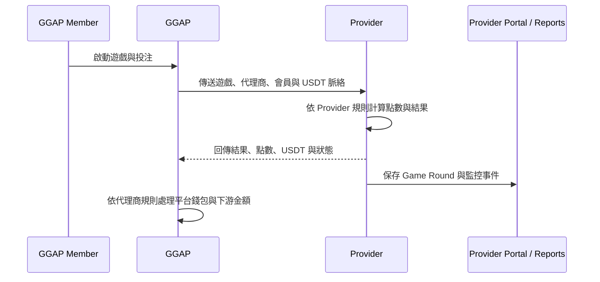

# Provider 與 GGAP 對接契約

> 版本：0.1.0
> 更新日期：2026-08-06
> 狀態：工作契約草案，需由 GGAP 與後端團隊核准

本文件是 Provider Portal 對接 GGAP 的補充契約。GGAP 平台完整規格仍以 [`GGAP_final_system_spec_tech.html`](./GGAP_final_system_spec_tech.html) 為準；本文件不改寫 GGAP 平台規格。

## 1. 對接角色

## 2. 責任分界

| 項目 | Provider | GGAP |
|---|---|---|
| 遊戲主資料 | 擁有與管理 | 同步 / 讀取 |
| 遊戲全域上下架 | 控制 | 接收狀態 |
| 代理商個別開關 | 不控制 | 控制 |
| 會員登入與錢包 | 不負責 | 負責 |
| 遊戲規則、RTP、限紅 | 擁有與執行 | 不改寫 |
| Provider 點數 | 計算與保存 | 依契約傳送 / 接收 |
| USDT | 對接標準值 | 對接與下游換算 |
| Game Round | 產生與保存 | 傳入脈絡、接收結果 |
| 平台對帳 | 提供正確資料 | 財務執行比對 |

## 3. 對接流程

### 3.1 遊戲目錄同步

Provider 提供遊戲主資料給 GGAP，至少包含：

- `game_id`、`game_name`、`game_type`
- 遊戲狀態、版本與資產版本
- 遊戲支援幣別與 USDT 對接資訊
- 點數規則、限紅與必要的展示資訊
- Provider 更新時間與版本號

GGAP 可以保存同步資料並在平台側建立自己的代理商開關，但不能把代理商開關回寫成 Provider 全域上下架。

### 3.2 啟動遊戲

GGAP 呼叫 Provider 時，應提供：

- `provider_id`
- `game_id`
- `agent_id`，若 GGAP 脈絡有代理商
- `merchant_id`，若 GGAP 脈絡有商戶
- `member_id`
- `currency`，現階段以 `USDT` 為主
- `request_id` / `launch_id`
- 簽章、時間戳與必要的防重放欄位

目前 slots 與單人 Crash 不需要 Provider 建立 Game Session。若未來多人玩法需要共享局號，另增加多人 round context。

### 3.3 遊戲結算

Provider 回傳或保存：

- `round_id`、`external_round_id`
- 遊戲與 GGAP 脈絡快照
- `bet_points`、`payout_points`、`net_result_points`
- `bet_usdt`、`payout_usdt`、`net_result_usdt`
- `conversion_rule_id`
- `started_at`（可為空）與 `settled_at`
- `status`
- `request_id`、`provider_event_id`

目前老虎機與單人 Crash 的單局淨輸贏定義為：`net_result = payout - bet`。GGR 是否與玩家淨輸贏相同，仍由 Provider 財務規格另行確認；欄位名稱必須與本節定義一致，不得另行使用舊版派彩或淨值命名。

同一個外部請求重試時，Provider 必須以冪等鍵回傳相同結果，不可重複產生投注。

## 4. 狀態分離

遊戲商與 GGAP 至少有三種不同狀態，不應合併：

1. **Provider 遊戲狀態**：草稿、已上架、已下架、維護、退役。
2. **GGAP 代理商可見狀態**：對特定代理商開啟或關閉。
3. **Game Round 狀態**：處理中、已結算、取消、回滾或失敗。

Provider Portal 只控制第一種；可以檢視第二種的同步結果，但不應把它當作 Provider 全域狀態。

## 5. 環境與版本啟用

三個環境的對接責任不同：

| 環境 | 是否接 GGAP 正式平台 | 是否可實際遊玩 | 版本責任 |
|---|---:|---:|---|
| 正式環境 | 是 | 是 | 技術部署，Provider 啟用 |
| 官網 DEMO | 否，使用 DEMO / 沙盒服務 | 是 | 技術部署，Provider 啟用 |
| 測試環境 | 否 | 依測試環境而定 | 前後端 / DevOps 部署，Portal 只讀監控 |

DEMO 不得使用 GGAP 正式會員錢包、正式代理商帳務或正式結算。DEMO 的遊戲請求、遊戲結果與 Game Round 必須帶有明確環境識別，避免混入正式資料。

Provider Portal 的版本啟用不是程式部署：

1. 技術團隊先完成版本建置與環境部署。
2. Provider 在遊戲管理的「環境與發布」頁查看可啟用版本。
3. Provider 針對正式或 DEMO 環境啟用指定版本。
4. 系統留下操作者、版本、環境、時間與啟用結果。
5. 若 GGAP 同步失敗，Provider 看到同步錯誤，但不直接修改 GGAP 代理商開關。

## 6. 金額與精度

- GGAP 與 Provider 的標準對接幣別為 USDT。
- Provider 點數換算規則由 Provider 擁有，需有 `conversion_rule_id` 或等效版本欄位。
- 點數與 USDT 建議以 decimal / string 傳輸，不使用浮點數。
- Provider 回傳的 USDT 是該次遊戲結果依當時規則換算的結果，不是日後用最新規則重算。
- GGAP 下游代理商 / 商戶金額換算，不回寫為 Provider 點數規則。

## 7. 錯誤、重試與冪等

Provider 與 GGAP 需共同確認以下規則：

| 情況 | 要求 |
|---|---|
| 重複 `request_id` | 回傳第一次處理結果，不重複入帳 |
| 不存在的遊戲 | 穩定錯誤碼，不能以成功空結果代替 |
| 遊戲已下架 | 拒絕新啟動，但既有已結算局不受影響 |
| GGAP 逾時 | 支援查詢或補償機制，不直接重複寫入 |
| Provider 結算失敗 | 保存失敗事件並產生通知 |
| 回呼重送 | 以 `provider_event_id` 去重 |
| 時間戳過期 | 拒絕或進入明確的重試流程 |

錯誤回應至少需要 HTTP status、穩定 `error_code`、訊息、`request_id` 與可判斷是否重試的 `retryable`。

## 8. 安全要求

- 使用正式 JWT 或雙向簽章，不沿用目前 mock token。
- 每次請求驗證來源、簽章、時間戳與重放風險。
- 所有 Provider 內部查詢強制套用 `provider_id`。
- 不在一般遊戲列表或 Game Round 列表回傳 secret、私鑰或完整敏感憑證。
- 保存對接請求、回應、錯誤與操作者 audit log。

## 9. 待確認清單

- 正式 base URL、API version 與認證方式。
- GGAP 提供的代理商、商戶與會員欄位名稱。
- `external_round_id`、`request_id` 與 `round_id` 的唯一性關係。
- Game Round 的取消、退款、回滾與補單流程。
- USDT 精度、點數精度與四捨五入方向。
- 多人玩法的共享 round 與參與者資料。
- DEMO 使用的沙盒點數 / 錢包來源，以及 DEMO 報表是否需要獨立呈現。
