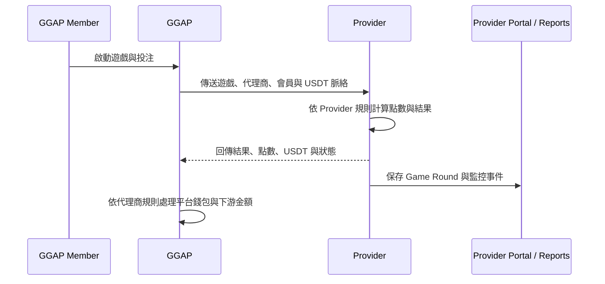

# Provider 與 GGAP 對接契約

> 版本：0.4.0
> 更新日期：2026-08-18
> 狀態：目前產品責任基準；實際 endpoint、payload、簽章與 enum 待 GGAP／Backend Git Mapping

本文件是 Provider Portal 對接 GGAP 的補充契約。遊戲版本與發布責任依 [`Decision Pack 03｜遊戲版本與發布生命週期`](./spec-book/content/appendices/decision-pack-03-game-release-lifecycle.md)；GGAP 平台完整規格仍以 [`GGAP_final_system_spec_tech.html`](./GGAP_final_system_spec_tech.html) 為準。本文件定義希望達成的產品邊界，不以現有 API 命名取代後續 Mapping。

## 1. 對接角色

## 2. 責任分界

| 項目 | Provider | GGAP |
|---|---|---|
| 遊戲主資料 | 擁有與管理 | 同步 / 讀取 |
| 遊戲全域上下架 | 控制 | 接收狀態 |
| 代理商個別開關 | 不控制 | 控制 |
| 會員登入與錢包 | 不負責 | 負責 |
| 遊戲規則、RTP、限紅 | 擁有與執行 | 不改寫 |
| Provider 點數 | 計算與保存 | 依契約傳送 / 接收 |
| USDT | 對接標準值 | 對接與下游換算 |
| Game Round | 產生與保存 | 傳入脈絡、接收結果 |
| 平台對帳 | 提供正確資料 | 財務執行比對 |

## 3. 對接流程

### 3.1 遊戲目錄同步

Provider 提供遊戲主資料給 GGAP，至少包含：

- `game_id`、`game_name`、`game_type`
- Provider 全域可用性、Active Version、`release_id` 與資產版本
- 遊戲支援幣別與 USDT 對接資訊
- 點數規則、限紅與必要的展示資訊
- `build_id`／Artifact checksum、Provider 更新時間與事件版本

GGAP 可以保存同步資料並在平台側建立自己的代理商開關，但不能把代理商開關回寫成 Provider 全域上下架。

### 3.2 啟動遊戲

GGAP 呼叫 Provider 時，應提供：

- `provider_id`
- `game_id`
- `agent_id`，若 GGAP 脈絡有代理商
- `merchant_id`，若 GGAP 脈絡有商戶
- `member_id`
- `currency`，現階段以 `USDT` 為主
- `request_id` / `launch_id`，由 Provider 建立短效 Launch Context
- 簽章、時間戳與必要的防重放欄位

Launch Context 綁定 `game_id`、Version、Build、Release、environment、幣別、語系與 GGAP Context，只用於安全與路由，不建立長期 Game Session。若未來多人玩法需要共享局號，另增加多人 round context。

### 3.3 遊戲結算

Provider 回傳或保存：

- `round_id`、`external_round_id`
- 遊戲與 GGAP 脈絡快照
- `bet_points`、`payout_points`、`net_result_points`
- `bet_usdt`、`payout_usdt`、`net_result_usdt`
- `conversion_rule_id`
- `started_at`（可為空）與 `settled_at`
- `status`
- `request_id`、`provider_event_id`

`provider_event_id` 是 Provider 與 GGAP 對接事件的識別碼，主要用於 Callback 重送去重，不等同於 Provider 風控事件的 `risk_event_id`。風控事件規則見 [`PROVIDER_RISK_CONTROL_SPEC.md`](./PROVIDER_RISK_CONTROL_SPEC.md)。

目前老虎機與單人 Crash 的單局淨輸贏定義為：`net_result = payout - bet`。GGR 是否與玩家淨輸贏相同，仍由 Provider 財務規格另行確認；欄位名稱必須與本節定義一致，不得另行使用舊版派彩或淨值命名。

同一個外部請求重試時，Provider 必須以冪等鍵回傳相同結果，不可重複產生投注。

## 4. 狀態分離

遊戲商與 GGAP 至少有三種不同狀態，不應合併：

1. **Provider 全域可用性**：`unpublished`、`available`、`maintenance`、`suspended`、`retired`。
2. **GGAP 代理商可見狀態**：對特定代理商開啟或關閉。
3. **Game Round 狀態**：處理中、已結算、取消、回滾或失敗。

Version 成熟度、Release 執行結果與 Active Release 另為獨立狀態，不能併入以上三者。Provider Portal 控制第一種；可以檢視第二種的同步結果，但不得把它當作 Provider 全域可用性。

## 5. 環境與版本啟用

三個環境的對接責任不同：

| 環境 | 是否接 GGAP 正式平台 | 是否可實際遊玩 | 版本責任 |
|---|---:|---:|---|
| 正式環境 | 是 | 是 | 只接受 DEMO 已通過的同一 Artifact；Provider 發布與管理全域可用性 |
| 官網 DEMO | 否，使用 DEMO / 沙盒服務 | 是 | Provider 發布候選 Artifact 並完成整合驗證 |
| 測試環境 | 否 | 依測試環境而定 | 具權限編輯者可快速發布 build 與重跑驗證 |

DEMO 不得使用 GGAP 正式會員錢包、正式代理商帳務或正式結算。DEMO 的遊戲請求、遊戲結果與 Game Round 必須帶有明確環境識別，避免混入正式資料。

Provider Release 透過既有建置與部署工具執行，但產品流程由 Provider 管理：

1. Version 綁定不可變 Artifact；Test 可反覆 build 與驗證。
2. 同一候選 Artifact 依序完成 DEMO 驗證，再晉級 Production；Production 必須使用同一份 Artifact，不得重新 build。
3. 系統自動檢查風險；一般 Release 一位發布管理者即可，高風險才要求第二人核准。
4. 每次發布、失敗重試與回滾建立新的 Release Record，保存操作者、版本、Build、環境、時間、前後 Active Release 與結果。
5. Provider 全域上架等待 GGAP ACK 後才對外開放；維護、暫停、隔離或退役先由 Provider 立即拒絕新 Launch，再可靠通知 GGAP。
6. GGAP 同步失敗不得讓 Provider 緊急保護失效，也不得由 Provider 直接修改 GGAP 代理商開關。

最終允許 Launch 必須同時滿足：Provider 為 `available`、存在 Production Active Release、沒有維護／暫停／隔離、GGAP 已對該代理商開放，且 GGAP 判定代理商、商戶與會員可使用。

## 6. 金額與精度

- GGAP 與 Provider 的標準對接幣別為 USDT。
- Provider 點數換算規則由 Provider 擁有，需有 `conversion_rule_id` 或等效版本欄位。
- 點數與 USDT 建議以 decimal / string 傳輸，不使用浮點數。
- Provider 回傳的 USDT 是該次遊戲結果依當時規則換算的結果，不是日後用最新規則重算。
- GGAP 下游代理商 / 商戶金額換算，不回寫為 Provider 點數規則。

## 7. 錯誤、重試與冪等

Provider 與 GGAP 需共同確認以下規則：

| 情況 | 要求 |
|---|---|
| 重複 `request_id` | 回傳第一次處理結果，不重複入帳 |
| 不存在的遊戲 | 穩定錯誤碼，不能以成功空結果代替 |
| 遊戲未上架、維護、暫停或退役 | 拒絕新 Launch；既有 Round 仍依原版本完成必要結算與 Callback |
| GGAP 逾時 | 支援查詢或補償機制，不直接重複寫入 |
| Provider 結算失敗 | 保存失敗事件並產生通知 |
| 回呼重送 | 以 `provider_event_id` 去重 |
| 時間戳過期 | 拒絕或進入明確的重試流程 |

錯誤回應至少需要 HTTP status、穩定 `error_code`、訊息、`request_id` 與可判斷是否重試的 `retryable`。

## 8. 風控隔離與 GGAP 通知

Provider 因遊戲服務或資料異常執行的隔離，是 Provider 全域遊戲狀態控制，不等於 GGAP 對個別代理商設定的遊戲開關。正式環境發生隔離、解除隔離或自動緩解失敗時，Provider 應通知 GGAP，讓 GGAP 能停止新的遊戲啟動並保留一致的營運狀態。

### 8.1 對接行為

- 隔離、維護、暫停與回滾只改變新 Launch／新 Round；既有 Game Round 的 Settle、Cancel、Refund、Callback 與必要重試仍依原 Version／Release 完成。
- Provider 應使用核准且版本化的風控規則決定是否隔離，不得只依嚴重度直接停機。
- Provider 解除隔離前必須完成健康檢查與授權覆核，解除後同樣通知 GGAP，不得靜默恢復。
- GGAP 收到通知後的代理商與玩家端行為，需由正式對接契約確認；不得由 Provider Portal 假設或直接修改 GGAP 代理商設定。

建議事件名稱暫定為 `provider_game_isolated`、`provider_game_released` 與 `provider_mitigation_failed`，正式名稱待 GGAP 確認。

### 8.2 通知欄位

| 欄位 | 說明 |
|---|---|
| `provider_id` | Provider 識別碼 |
| `game_id` / `game_version` | 受影響遊戲與版本 |
| `environment` | Production、DEMO 或 Test |
| `provider_risk_event_id` | 對應 Provider `risk_event_id`，供雙方追蹤同一風控事件 |
| `provider_event_id` | 本次通知事件的冪等與去重識別碼 |
| `severity` | 通知當下的風險嚴重度 |
| `mitigation_action` / `mitigation_scope` | 已執行動作與實際作用範圍 |
| `effective_at` | 隔離、解除或失敗生效時間 |
| `reason_code` | 穩定且可供程式判斷的原因碼 |
| `request_id` | 本次 HTTP 請求追蹤識別碼 |

`provider_event_id` 用於同一通知的重送去重；`provider_risk_event_id` 用於關聯完整 Risk Event，兩者不得互相取代。

### 8.3 ACK、重試與失敗

- GGAP 必須回傳可判斷接受結果的 ACK、穩定錯誤碼與 `request_id`。
- Provider 在逾時或可重試錯誤時，以同一 `provider_event_id` 進行有限次數重送，GGAP 不得重複變更狀態。
- 通知失敗時，Provider 必須保留重試狀態並建立或升級 Critical 告警，不得把 GGAP 狀態標記為已同步。
- 隔離與解除通知皆適用相同的簽章、冪等、稽核與重試要求。

正式 endpoint、認證、ACK 格式、重試次數、退避規則與 GGAP 端玩家行為尚待雙方確認。

## 9. 安全要求

- 使用正式 JWT 或雙向簽章，不沿用目前 mock token。
- 每次請求驗證來源、簽章、時間戳與重放風險。
- 所有 Provider 內部查詢強制套用 `provider_id`。
- 不在一般遊戲列表或 Game Round 列表回傳 secret、私鑰或完整敏感憑證。
- 保存對接請求、回應、錯誤與操作者 audit log。

## 10. 待確認清單

- 正式 base URL、API version 與認證方式。
- GGAP 提供的代理商、商戶與會員欄位名稱。
- `external_round_id`、`request_id` 與 `round_id` 的唯一性關係。
- Game Round 的取消、退款、回滾與補單流程。
- USDT 精度、點數精度與四捨五入方向。
- 多人玩法的共享 round 與參與者資料。
- DEMO 使用的沙盒點數 / 錢包來源，以及 DEMO 報表是否需要獨立呈現。
- 風控隔離、解除與緩解失敗通知的 endpoint、事件名稱與 ACK 格式。
- GGAP 收到隔離通知後，對新 Launch、既有 Round 與代理商狀態的正式行為。
- 通知重試次數、退避規則、保存期限與人工補送機制。
- Game、Version、Artifact、Release、Launch Context 與 Active Release 的現有資料表、enum 及 API Mapping。
