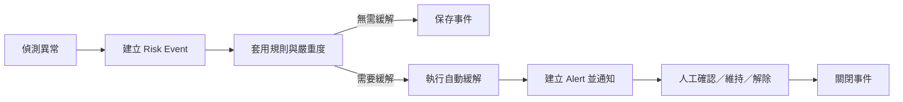

# Provider 風控與異常事件規範

> 版本：0.3.0
> 更新日期：2026-08-10
> 狀態：Provider Portal 第一版風控規範草案；事件門檻、API 欄位與 GGAP 對接狀態待確認

本文件定義 Provider Portal 如何辨識、分類、查詢與處理 Provider 自己的遊戲、Game Round、服務與 GGAP 對接異常。

本文件是風控報表與風控告警／處理頁面的共同基礎。它先統一產品、前端、後端、QA 與 GGAP 對「失敗、逾時、延遲、資料異常、嚴重度」的理解；正式 API 狀態碼與實際門檻仍需由後端與 GGAP 對接團隊確認。

## 1. 規範目的

- 統一遊戲商風控事件的名稱、定義與分類。
- 建立監控總覽、風控報表與風控告警／處理之間的責任分工。
- 讓每筆異常都可以回溯到遊戲、版本、Game Round 與 GGAP 對接事件。
- 提供後端建立事件、前端呈現報表、QA 驗證狀態的共同依據。
- 避免將 GGAP 平台的代理商、商戶、會員、錢包或平台風控責任混入 Provider Portal。

## 2. 責任範圍

### 2.1 Provider Portal 負責

- 遊戲商遊戲服務健康度。
- 遊戲商遊戲的 Launch、Game Round、Settle 與相關回呼處理。
- 遊戲商遊戲資料、版本、遊戲規則與數值結果異常。
- 遊戲商與 GGAP 之間的請求、回應、Callback、重試與錯誤狀態。
- 遊戲商自己的異常查詢、風險分析、告警處理與操作紀錄。

### 2.2 GGAP 負責

- GGAP 平台整體健康與平台級風控。
- 代理商、商戶、會員、平台錢包與平台交易風控。
- GGAP 代理商側的幣別、金額轉換與平台結算。
- GGAP 對多家遊戲商的聚合層級告警與平台處理。

Provider Portal 可以保存 GGAP 傳入的代理商、商戶、會員與幣別脈絡，作為單筆 Game Round 或異常追蹤的關聯資料，但不建立上述主資料或平台風控規則。

### 2.3 共用中文術語與顯示規則

Provider Portal 的主要介面以台灣繁體中文呈現；英文只在技術值、原始欄位名稱、協定資訊或選項輔助說明中保留。共用術語如下：

| 技術術語 | 一般畫面顯示 | 選項或詳情輔助顯示 |
|---|---|---|
| Risk Event | 風控事件 | 風控事件（Risk Event） |
| Game Round | 遊戲回合 | 遊戲回合（Game Round） |
| Provider | 遊戲商 | 遊戲商（Provider） |
| Provider Game Round ID | 遊戲商遊戲回合 ID | 遊戲商遊戲回合 ID（Provider Game Round ID） |
| GGAP Round ID | GGAP 遊戲回合 ID | GGAP 遊戲回合 ID（GGAP Round ID） |
| Launch | 啟動 | 啟動（Launch） |
| Settle | 結算 | 結算（Settle） |
| Callback | 回呼 | 回呼（Callback） |
| Request / Response | 請求／回應 | 請求（Request）／回應（Response） |
| Error message | 錯誤訊息 | 錯誤訊息（Error message） |
| Tips | 提示 | — |

表格欄位、摘要卡與狀態標籤使用簡潔中文，避免每列重複英文。Production 顯示為「正式環境」、DEMO 顯示為「展示環境」，環境選項可使用「正式環境（Production）」與「展示環境（DEMO）」；Test 不納入本頁。Info、Low、Medium、High、Critical 一般顯示為「資訊、低、中、高、嚴重」，選項可附上英文原值。

上述規則只改變顯示文字，不得翻譯或改動 API 值、路由、ID、錯誤碼、HTTP 狀態碼、版本號、原始欄位名稱與協定路徑。事件證據中的請求／回應摘要與時間線可翻譯說明文字，但應保留必要的 HTTP method、endpoint、狀態碼、識別碼與原始技術值。

## 3. 三個頁面的責任分工

| 頁面 | 主要問題 | 可呈現內容 | 是否執行處理 |
|---|---|---|---|
| 監控總覽 | 現在是否有問題？ | 五張監控摘要卡、健康狀態、異常摘要與快速導向 | 不執行正式處理 |
| 風控報表 | 發生了什麼問題？影響範圍為何？ | 查詢、摘要、待關注異常、事件列表、詳情與匯出 | 唯讀查詢分析 |
| 風控告警／處理 | 接下來要怎麼處理？ | 告警佇列、處理狀態、隔離、解除、通知 GGAP、操作紀錄 | 可執行核准後的遊戲商操作 |

風控報表不取代遊戲紀錄。需要查看單筆 Game Round 完整內容時，應導向 `/reports`「遊戲紀錄」頁面。

## 4. 異常事件模型

每一筆風控異常應被視為一筆可追蹤的 `Risk Event`，至少包含以下概念欄位：

| 欄位 | 說明 |
|---|---|
| Event ID | 遊戲商風控事件唯一識別碼，正式欄位名為 `risk_event_id` |
| 發生時間 | 異常實際發生時間；另保留偵測時間 |
| 異常來源 | Game Service、Game Round、GGAP Request、Callback、Data Quality 或 Game Math |
| 異常類型 | 具體事件，例如結算失敗、請求逾時、資料缺失 |
| 嚴重度 | Info、Low、Medium、High、Critical |
| 處理狀態 | 待處理、調查中、已緩解、已關閉、誤報 |
| 遊戲資訊 | Game ID、遊戲名稱、遊戲類型、遊戲版本 |
| 環境 | Production 或 DEMO；Test 不納入 Provider 風控監控與告警 |
| Round 關聯 | Provider Game Round ID、GGAP Round ID、會員 ID（若有） |
| 事件數值 | 延遲、逾時、失敗率、異常數量、RTP 或派彩等相關數值 |
| 原因資訊 | 錯誤碼、錯誤訊息、請求／回應摘要與重試次數 |
| 操作紀錄 | 誰在何時執行了什麼處理、處理結果與備註 |

單一事件可能關聯多個 Game Round，例如短時間大量結算失敗；此時應保存事件摘要與受影響 Round 數量，並提供查詢明細的入口。

### 4.1 Event ID 規範

Provider 風控事件的正式欄位名稱為 `risk_event_id`，前端畫面與報表欄位可顯示為 **Event ID**。

#### 格式

格式統一為：

```text
rsk_<ULID>
```

規則如下：

- `rsk_` 是固定的小寫識別前綴。
- `<ULID>` 為 26 字元的 Crockford Base32 ULID，API 與匯出使用小寫表示。
- 範例：`rsk_01jz4m8v3k6q2d7p9x5n1c0bqa`。
- Event ID 只使用 ASCII 字元，不包含 Provider ID、會員 ID、Game Round ID、金額或錯誤訊息。
- Event ID 不作為業務排序依據；列表排序使用 `occurred_at` 或 `detected_at`。

#### 產生與唯一性

- 由 Provider 風控事件服務在第一次建立 `Risk Event` 時產生。
- 事件一旦建立，`risk_event_id` 永久不變，不因嚴重度、處理狀態或事件內容更新而變更。
- Event ID 在所有 Provider 範圍內必須唯一，不得重複使用或回收。
- 建議資料庫建立唯一索引；API、列表、詳情、匯出與操作紀錄均使用同一個值。
- 若事件建立失敗且沒有成功保存，不應先對外宣告該 ID 已成立；重新建立時產生新的 ID。

#### 重試、去重與聚合

- 同一個請求的重試不產生新的 `risk_event_id`，應保留原 ID 並累計重試次數與後續結果。
- 同一個異常事件的狀態更新、告警升級、緩解與關閉都沿用原 ID。
- 在同一個聚合時間窗口內，符合相同 Provider、環境、異常來源、異常類型、遊戲與錯誤特徵的重複發生，可聚合為同一個事件；保存 `first_seen_at`、`last_seen_at`、`occurrence_count` 與受影響 Round 數量。
- 跨越新的聚合窗口、影響條件已改變，或前一事件已關閉後再次發生時，建立新的 Event ID，並可透過關聯欄位連結前後事件。
- 原始請求、回應、日誌或單次偵測紀錄若需要逐筆追蹤，應另有 `occurrence_id`、`request_id` 或 `provider_event_id`，不可用多個 Event ID 代替。

#### 與其他識別碼的關係

| 識別碼 | 用途 | 是否等同 `risk_event_id` |
|---|---|---|
| `risk_event_id` | Provider 風控事件生命週期與報表追蹤 | 本規範的 Event ID |
| `provider_event_id` | Provider 與 GGAP 對接事件、Callback 重送去重 | 否 |
| `request_id` | 單次 API 請求追蹤與冪等 | 否 |
| `round_id` | Provider Game Round 業務紀錄 | 否 |
| `external_round_id` / `ggap_round_id` | GGAP Round 關聯識別 | 否 |

一個 `risk_event_id` 可以關聯多個 `request_id`、`provider_event_id` 或 Game Round。若對接事件觸發風控事件，必須同時保存兩種識別碼，不得互相覆寫。

對外通知 GGAP 時，若契約需要傳遞 Provider 風控事件識別，欄位名稱使用 `provider_risk_event_id`，值等於 Provider 的 `risk_event_id`；此欄位只作關聯追蹤，不取代 `provider_event_id` 的 Callback 去重用途。

## 5. 核心狀態定義

### 5.1 失敗（Failure）

請求或業務流程已結束，但結果明確為失敗，或收到可判定為失敗的錯誤回應。

**判定特徵：**

- 已收到回應，且回應狀態表示失敗。
- 或後端已判定流程無法完成並寫入失敗結果。
- 不因單純尚未收到回應而直接判定為失敗。

**例子：**

- Settle 回應為 rejected 或 error。
- Game Round 因必要欄位錯誤而無法結算。
- Callback 收到明確的無效請求回應。

### 5.2 逾時（Timeout）

在規定等待時間內沒有收到必要回應，導致系統無法在預期時間內判定流程結果。

**判定特徵：**

- 請求已送出，但超過 timeout threshold 未收到回應。
- 逾時不等於最終失敗；後續可能收到延遲回應、重試成功或被人工處理。
- 逾時事件應保留首次發生時間、等待秒數與後續結果。

### 5.3 延遲（Latency）

請求最終成功或完成，但處理時間超過正常服務門檻。

**判定特徵：**

- 有完整的開始與完成時間。
- 完成結果可以是成功，也可以另外產生失敗事件。
- 延遲是時間量測結果；逾時是超過等待上限後仍沒有結果，兩者不可混為同一狀態。

### 5.4 資料異常（Data Anomaly）

資料存在缺失、格式錯誤、重複、矛盾或無法與關聯資料正確對應的情況。

**第一版包含：**

- 必填欄位缺失。
- 欄位格式、型別或精度不符合契約。
- Provider Game Round ID 或 GGAP Round ID 無法對應。
- 同一事件或 Game Round 重複寫入。
- Game Round 狀態與結算結果不一致。
- Callback、重試結果與原始請求無法建立關聯。

資料異常不直接等同於 GGAP 對帳不一致。Provider Portal 可以標記自身資料關聯問題；雙方財務對帳仍由財務與 GGAP 依對帳流程執行。

## 6. 第一版異常分類

### 6.1 遊戲服務異常（Game Service）

- 遊戲服務不可用。
- 健康檢查失敗。
- 遊戲服務錯誤率升高。
- 遊戲版本啟動失敗。

### 6.2 Game Round 異常（Game Round）

- Game Round 建立失敗。
- Game Round 未完成或長時間停留在中間狀態。
- Game Round 結算失敗。
- 重複結算或重複寫入。
- Game Round 狀態與結算結果不一致。

### 6.3 GGAP 對接異常（Integration）

- Launch 請求失敗。
- Settle 請求失敗。
- Callback 失敗或未收到。
- 請求逾時。
- 請求延遲超過門檻。
- 重試次數達上限。
- GGAP 回應錯誤或欄位無法解析。

### 6.4 資料品質異常（Data Quality）

- 必填資料缺失。
- 資料格式或精度錯誤。
- Round ID 關聯失敗。
- 事件重複。
- 狀態轉移不合法。

### 6.5 遊戲數值異常（Game Math）

- 實際 RTP 長時間偏離理論 RTP。
- 派彩結果超過遊戲設定或限紅範圍。
- 單筆派彩或短時間派彩量異常。
- 點數換算結果不符合當時規則版本。

遊戲數值異常需要搭配遊戲規則、數值設定與統計樣本量判斷，不能只依單筆結果直接判定為風控事件。正式門檻待數值團隊與產品確認。

### 6.6 不納入第一版

- 會員下注習慣或會員信用風險。
- 代理商、商戶或平台交易風險。
- 代理商側幣別與錢包異常。
- GGAP 平台級詐欺、洗錢或合規風險。

上述內容若未來需要，應由 GGAP 或其他負責模組另立規範。

## 7. 嚴重度分類

嚴重度應綜合影響範圍、持續時間、發生比例、是否影響結算與是否需要立即操作判斷。第一版先使用五級分類：

| 等級 | 定義 | 例子 | 預設處理 |
|---|---|---|---|
| Info | 已記錄但不代表異常，或已自動恢復的事件 | 單次可恢復延遲、重試成功 | 保留紀錄，通常不需人工處理 |
| Low | 局部且影響有限，不影響主要結算流程 | 單筆資料格式錯誤、單一低影響服務警告 | 例行檢視 |
| Medium | 需要調查，可能影響部分遊戲或 Round | 某款遊戲延遲升高、少量結算失敗 | 建立處理項目並追蹤 |
| High | 已影響正常營運或持續擴大，需要優先處理 | 單款遊戲大量結算失敗、Callback 大量遺失 | 優先調查，評估暫停遊戲與通知 GGAP |
| Critical | 大範圍服務中斷、資料正確性受損或可能造成大量錯誤結算 | 多款遊戲無法結算、重複結算造成資料風險 | 立即升級、限制影響並啟動處理流程 |

嚴重度不應只由事件類型固定決定。同一類型的逾時可能因持續時間、受影響遊戲數與失敗比例不同而落在不同等級。

## 8. 自動緩解、隔離與人工確認

風控處理採用「系統先限制影響、人工再確認最終處置」的原則。自動動作必須可追蹤、可重試、可解除，並以最小影響範圍執行；前端頁面是否開啟，不得影響後端偵測與處理。



### 8.1 自動處理判斷

嚴重度只表示影響程度，不得單獨作為自動隔離條件。系統執行自動動作前，必須同時保存命中的 `rule_id`、`rule_version`、統計窗口、門檻、事件數值與處理範圍。

| 嚴重度 | 預設系統行為 | 人工處理要求 |
|---|---|---|
| Info | 保存事件；可記錄已成功的自動重試 | 通常不需處理 |
| Low | 保存事件並列入例行檢視 | 視需要確認 |
| Medium | 建立告警；可依核准規則重試或重新排隊 | 應於一般處理時限內確認 |
| High | 建立高優先告警並通知；只有命中核准規則時才可暫停特定範圍的新 Launch | 優先確認是否維持或解除 |
| Critical | 依核准規則執行最小範圍隔離、通知 GGAP 並建立緊急告警 | 立即確認影響、原因與後續處置 |

第一版允許的自動緩解動作：

- 依冪等鍵忽略重複請求或重複 Callback。
- 對可重試錯誤進行有限次數、具退避機制的重試。
- 將失敗 Callback 重新排入可靠佇列。
- 暫停指定遊戲、版本或環境的新 Launch。
- 建立告警、通知 Provider 人員及依契約通知 GGAP。

### 8.2 隔離定義與限制

本文件的「隔離」是 Provider 為避免影響擴大而採取的暫時性控制，不等於 GGAP 針對個別代理商設定的遊戲開關。

- 隔離只阻擋指定範圍的新 Launch，不中斷既有 Game Round 的正常完成流程。
- Settle、Callback、必要重試與稽核紀錄必須繼續運作，避免產生財務或資料不一致。
- 隔離範圍應優先限制在單一遊戲、版本與環境；只有證據顯示影響擴大時才提升範圍。
- 系統不得自動修改投注、派彩、已結算 Round 或換算結果，也不得以隔離取代正式回滾或補償流程。
- 隔離是暫時狀態，必須建立告警並要求人工覆核。
- 不採用單純到期即自動解除。解除前必須通過健康檢查並由具權限人員確認；超過覆核期限仍未處理時應升級告警。
- 自動緩解失敗時必須將 `mitigation_status` 標記為失敗並升級告警，不得回報已隔離或已恢復。

### 8.3 自動處理資料欄位

Risk Event 或其關聯 Alert 至少應保存：

| 欄位 | 說明 |
|---|---|
| `alert_id` | 告警唯一識別碼 |
| `rule_id` / `rule_version` | 命中的規則及其版本 |
| `mitigation_action` | retry、requeue_callback、block_new_launch、notify 等動作 |
| `mitigation_status` | 自動緩解目前狀態 |
| `mitigation_scope` | Provider、遊戲、版本、環境等實際作用範圍 |
| `auto_handled_at` | 自動處理時間 |
| `isolated_at` | 開始隔離時間；未隔離時為空 |
| `review_due_at` | 人工覆核期限 |
| `released_at` / `released_by` | 解除時間與操作者 |
| `requires_review` | 是否仍需人工確認 |
| `ggap_notification_status` | GGAP 通知、確認與重試狀態 |

`mitigation_status` 第一版使用下列值：

| API 值 | 顯示名稱 | 定義 |
|---|---|---|
| `not_required` | 不需處理 | 事件不需要自動緩解 |
| `pending` | 處理中 | 已決定執行，但動作尚未完成 |
| `applied` | 已套用 | 緩解或隔離已成功生效 |
| `failed` | 處理失敗 | 動作執行失敗，必須升級告警 |
| `released` | 已解除 | 緩解限制已由授權流程解除 |

### 8.4 頁面導向原則

監控總覽與風控報表都可直接導向「風控告警／處理」詳情，不要求使用者依序經過三張頁面。告警詳情需提供事件摘要、影響範圍、命中規則、自動動作、GGAP 通知狀態與操作紀錄，並保留返回風控報表及關聯 Game Round 的入口。

## 9. 處理狀態與生命週期

| 狀態 | 定義 |
|---|---|
| 待處理 | 已偵測且尚未由人員接手或確認 |
| 調查中 | 已有人員接手，正在確認原因與影響範圍 |
| 已緩解 | 已採取措施，主要影響停止或服務恢復，但仍可能需要後續檢討 |
| 已關閉 | 原因、影響與處理結果已確認，事件完成結案 |
| 誤報 | 經確認不構成實際異常，保留判定原因 |

建議生命週期：

`偵測 → 待處理 → 調查中 → 已緩解 → 已關閉`

事件若再次發生或影響擴大，可重新開啟或建立新的事件；不得直接覆蓋歷史處理紀錄。

## 10. 風控報表建議內容

### 10.1 查詢條件

- 時間區間。
- 遊戲類型。
- 遊戲。
- 遊戲版本。
- 異常來源。
- 異常類型。
- 嚴重度。
- 處理狀態。
- Provider Game Round ID。
- GGAP Round ID。
- 環境：Production 或 DEMO，單選且不可混合。

代理商、商戶與會員不列為第一版主要查詢維度；相關資訊只在事件詳情或導向 Game Round 時作為關聯脈絡呈現。

### 10.2 異常列表欄位

- 發生時間。
- 異常類型。
- 異常來源。
- 嚴重度。
- 遊戲名稱與版本。
- Provider Game Round ID。
- GGAP Round ID。
- 延遲／逾時時間或受影響數量。
- 處理狀態。
- 詳情入口。

列表預設依發生時間由新到舊排序；若事件是聚合事件，應額外顯示受影響 Game Round 數量與統計期間。

### 10.3 事件詳情

- 事件基本資料與時間線。
- 遊戲、版本與環境。
- Provider Game Round ID、GGAP Round ID。
- Launch、Settle、Callback 與重試狀態。
- 請求／回應摘要、錯誤碼與錯誤訊息。
- 延遲、逾時、失敗次數與受影響數量。
- 命中規則、自動緩解、隔離範圍與 GGAP 通知狀態。
- 關聯遊戲紀錄入口。
- 告警與處理紀錄。

### 10.4 匯出

第一版建議提供完整 CSV／Excel 匯出，至少包含列表欄位、事件定義、處理狀態、Round 關聯 ID 與事件數值。是否支援使用者自訂匯出欄位，待與其他報表的匯出方式統一。

## 11. 門檻與統計規則

以下項目需要後端、QA、數值團隊與 GGAP 對接團隊共同確認，暫不在本文件寫死數值：

| 項目 | 待確認內容 |
|---|---|
| Timeout threshold | Launch、Settle、Callback 各自的等待上限 |
| Latency threshold | 正常、警告與嚴重延遲的毫秒門檻 |
| Failure rate | 失敗率的統計分母、時間窗口與告警門檻 |
| Spike detection | 短時間異常量的基準與比較期間 |
| Missing callback | 判定未收到 Callback 的等待時間 |
| RTP deviation | 樣本量、統計期間、理論 RTP 偏移幅度 |
| Payout anomaly | 單筆與區間派彩的判斷方式 |
| Event aggregation | 多筆相同異常合併為一個事件的規則 |

所有門檻應支援版本化，事件建立時保存當時使用的規則版本，避免門檻修改後無法解釋歷史事件。

## 12. 後端與 GGAP 待確認資料

- Launch、Settle、Callback 的正式狀態枚舉與錯誤碼。
- Provider Game Round ID 與 GGAP Round ID 的關聯方式。
- 每種事件可取得的開始時間、完成時間、回應時間與重試時間。
- 請求與回應是否保存完整內容，或只保存可供報表使用的摘要。
- Callback 未收到、延遲與重試的判定來源。
- GGAP 是否提供 Provider 可查詢的告警或通知回傳機制。
- Provider 隔離或全域下架遊戲後，GGAP 的同步與玩家端行為。
- 風控事件由哪個服務產生、保存與聚合。
- 規則引擎、自動緩解執行器與告警服務的正式責任歸屬。
- GGAP 風控隔離通知的 API、ACK、重試與失敗處理方式。
- 隔離解除前的健康檢查、人工覆核時限與升級規則。
- 事件保存期限、查詢期限與匯出上限。
- Production 與 DEMO 使用同一事件模型，但查詢、摘要與告警不得混合統計。

## 13. 第一版不處理的項目

- 直接在風控報表列表執行隔離、解除或全域下架遊戲。
- 直接修改 Game Round、投注或派彩資料。
- GGAP 對帳匹配與財務差異判定。
- Provider 之外的會員、代理商或商戶風控規則。
- 尚未經後端確認的自動補單、補送或強制結算。
- 未經核准規則與門檻的自動隔離或自動停機。
- 以自動處理直接修改投注、派彩、換算結果或已結算 Round。

經核准的維持隔離、解除隔離、通知重送等營運操作，應放在「風控告警／處理」頁，並建立權限、確認、冪等與操作紀錄規則。投注、派彩、換算結果與已結算 Round 的修改仍屬禁止事項；未來若有補償需求，必須另立財務與 Game Round 補償規範。

## 14. 文件使用方式

後續製作風控報表時，應依本文件先確認：

1. 事件是否屬於 Provider 責任範圍。
2. 異常狀態是否符合本文件定義。
3. 異常類型與嚴重度是否可以被清楚區分。
4. 列表資料是否能導回 Game Round 或事件詳情。
5. 門檻、狀態碼與資料來源是否已標記為已確認或待確認。
6. 自動動作是否有核准規則、最小作用範圍、失敗處理與人工覆核流程。

本文件與 GGAP 最新規格或後端正式契約不一致時，須先由產品、後端與 GGAP 對接團隊確認後再更新。

## 15. 待確認清單

- Provider 風控事件資料模型、ULID 產生方式與唯一索引的後端實作。
- 異常類型是否採用上述第一版分類，及是否需要新增類型。
- 嚴重度是否維持五級，以及每級的數值門檻。
- Production 與 DEMO 的資料來源、隔離及通知流程是否已分開驗證。
- RTP、派彩與點數換算異常是否納入第一版。
- 風控報表是否提供自訂欄位匯出。
- 風控告警／處理頁的操作權限與核准流程。
- 各嚴重度可使用的自動緩解動作、覆核時限與升級方式。
- 隔離解除所需健康檢查、核准角色與 GGAP 通知流程。

風控報表的完整頁面規格見 [`PROVIDER_RISK_REPORT_SPEC.md`](./PROVIDER_RISK_REPORT_SPEC.md)；風控告警／處理的完整頁面規格見 [`PROVIDER_RISK_ALERT_HANDLING_SPEC.md`](./PROVIDER_RISK_ALERT_HANDLING_SPEC.md)。
